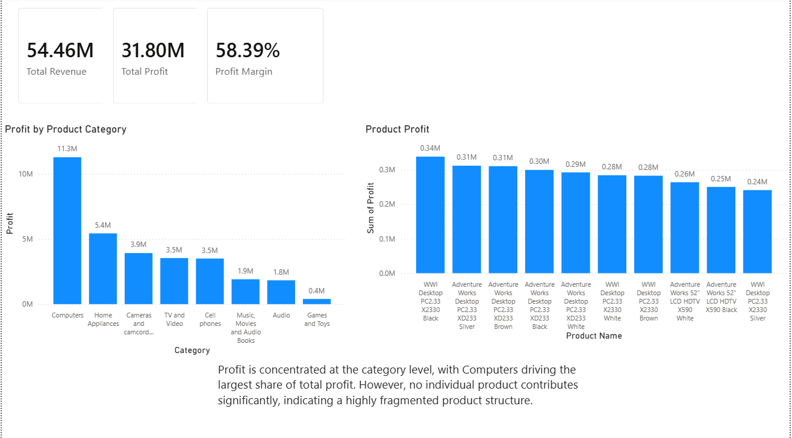
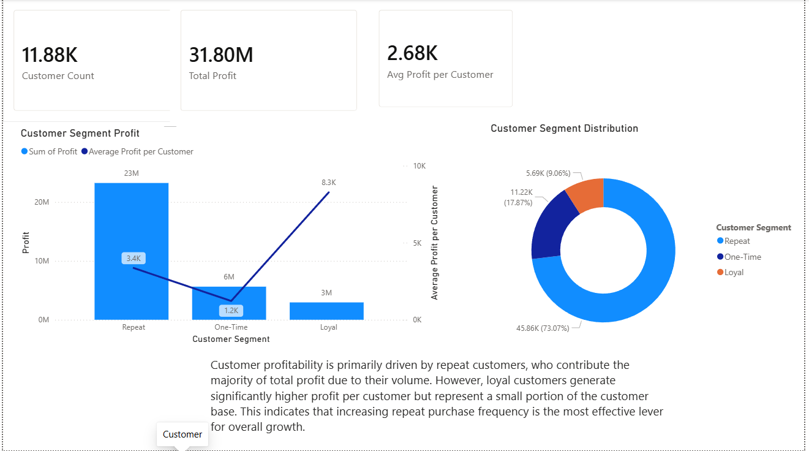

#  Retail Sales & Customer Analysis Dashboard

## Project Overview

This project analyzes retail sales data to identify key drivers of revenue and profitability across products and customer segments. The goal is to move beyond surface-level metrics and uncover actionable insights that can inform business decisions.

**Tools Used:**

* SQL (data preparation & transformation)
* Power BI (data modeling & dashboarding)

---

## Business Problem

Retail businesses often struggle to understand:

* Which products truly drive profitability
* Whether revenue is concentrated or distributed
* Which customer segments contribute the most value

This project answers:

> *Where does profit come from, and which customers drive it?*

---

## Dashboard Preview

### 🟦 Page 1: Product & Category Analysis

### 🟩 Page 2: Customer Analysis

---

## Key Insights

### Product & Category Insights

* Profit is **highly concentrated at the category level**, with *Computers (~35%)* leading all categories
* No individual product contributes significantly to total revenue (top products <1%)
* Revenue and profit are **widely distributed across the product catalog**

**Interpretation:**
The business relies on strong categories rather than standout individual products.

---

### Customer Insights

* **Repeat customers drive ~73% of total profit**, making them the primary revenue engine
* **Loyal customers generate the highest profit per customer**, but represent a small portion of the customer base
* One-time customers contribute the least in both total and average profit

 **Interpretation:**
Profitability is driven more by **purchase frequency (repeat behavior)** than by high-value individuals alone.

---

## Business Recommendations

* **Increase repeat purchase behavior**

  * Focus on retention campaigns and promotions
  * Encourage second and third purchases

* **Develop loyalty strategies for high-value customers**

  * Target loyal customers with exclusive offers or rewards
  * Maximize value from already high-performing customers

* **Optimize high-performing categories**

  * Prioritize inventory and marketing for top categories (e.g., Computers)
  * Explore bundling or upselling within these categories

---

## Technical Approach

### SQL (Data Preparation)

* Joined multiple tables: Sales, Customers, Products, Stores
* Created a `base_data` CTE for unified analysis
* Calculated key metrics:

  * Revenue = Quantity × Unit Price
  * Cost = Quantity × Unit Cost
  * Profit = Revenue – Cost

---

### Power BI (Modeling & Analysis)

* Built interactive dashboard with:

  * KPI cards (Revenue, Profit, Margin, Customers)
  * Category and product-level analysis
  * Customer segmentation (One-Time, Repeat, Loyal)

* Created measures for:

  * Profit
  * Profit Margin
  * Average Profit per Customer

* Designed a **combo chart** to compare:

  * Total profit (scale)
  * Average profit per customer (value)

---

## Key Takeaways

This project demonstrates:

* End-to-end analytics workflow (SQL → BI → insights)
* Ability to translate data into **business-relevant insights**
* Strong understanding of:

  * Aggregation logic
  * Customer segmentation
  * Data storytelling

